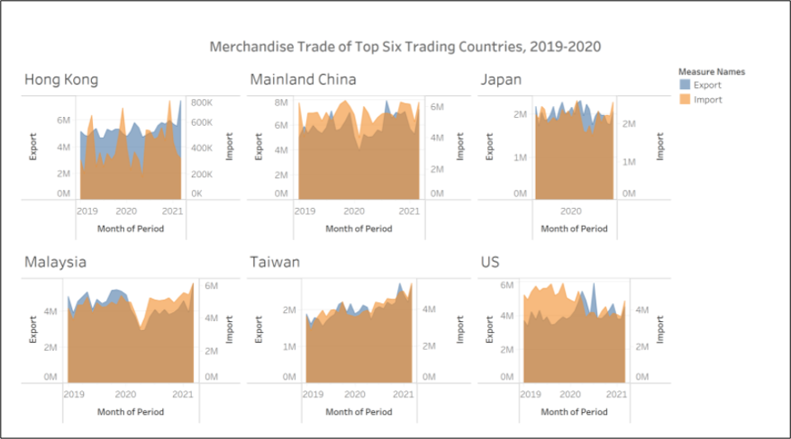
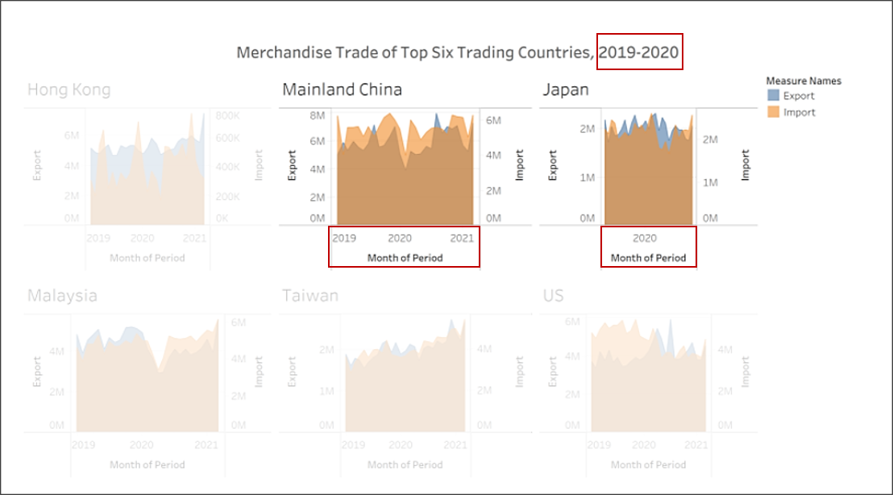
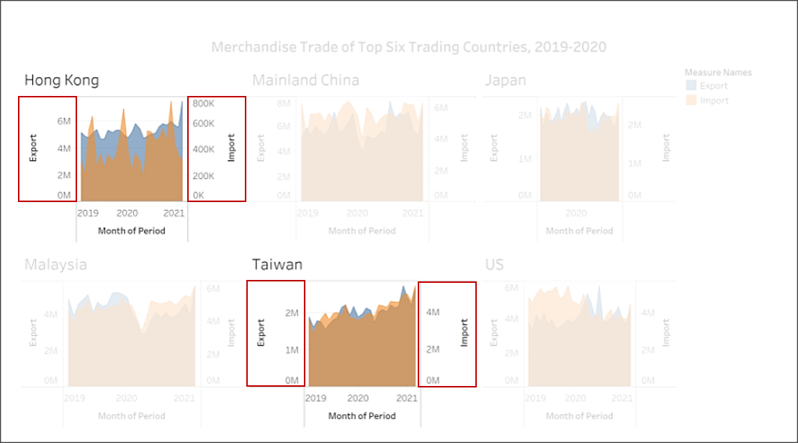
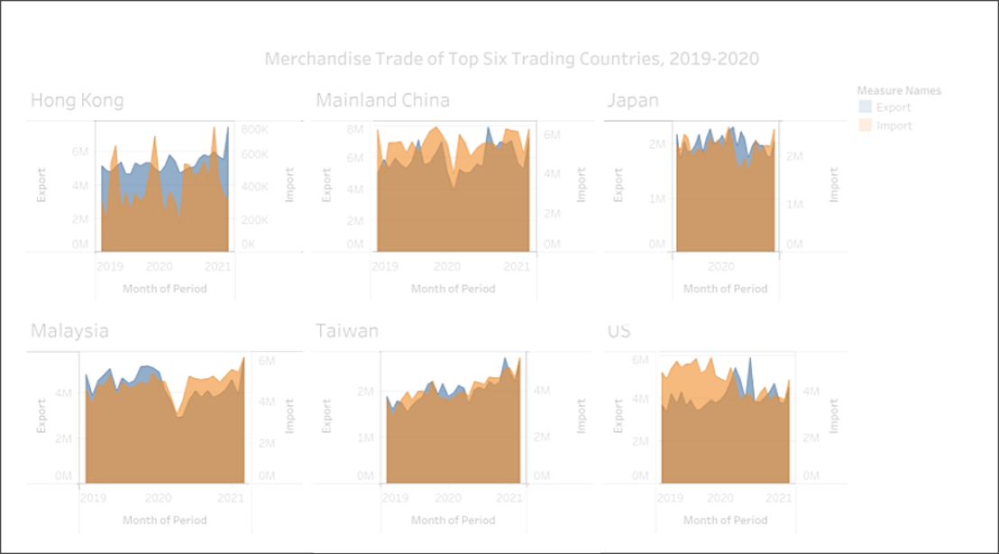
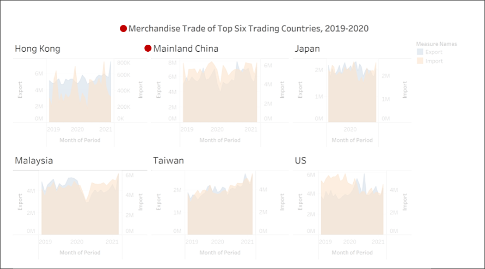
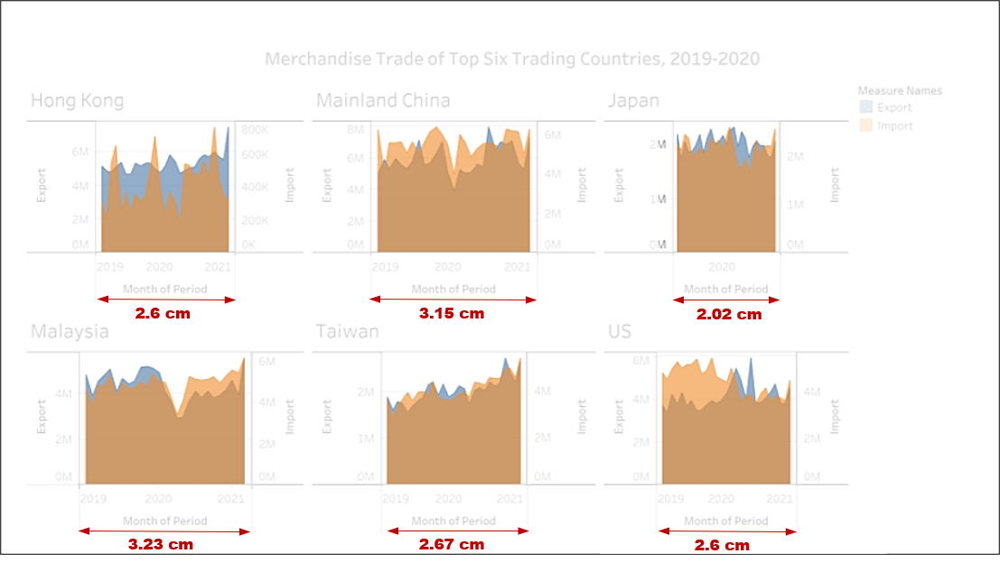
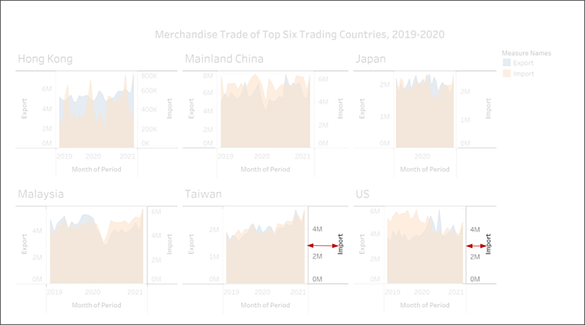

```{r setup, include=FALSE}
knitr::opts_chunk$set(echo = FALSE)
```

## 1: Introduction

The data in hand is the Merchandise Trade volume of Singapore with it's top 6 trade partners in 2019 and 2020. 

They are identified as:

1. China (Mainland)
2. Hong Kong
3. Malaysia
4. Japan
5. Taiwan
6. United States of America

This period of time is especially crucial (and interesting) as it is one of the most tumultuous times the world has faced, with nearly all sectors taking a massive hit -- **The COVID-19 Pandemic**.

The data was retrieved from the [Department of Statistics, Singapore (DOS)](https://www.singstat.gov.sg/find-data/search-by-theme/trade-and-investment/merchandise-trade/latest-data).

## 2: Original Data Visualization

The following is the original chart that was prepared:

```{r, fig.cap = 'Original Chart', out.width=554, out.height=307,out.extra='style="margin-left: 25px;"'}

```

This visualization will be critiqued on two parameters: Clarity and Aesthetics.

### 2.1: Critique: Clarity

Clarity is how clear/lucid the chart in it's message to the reader. The information should be free of ambiguity and confusion. 

The chart falters as such:

1. Title: The title of the graph says "2019 - 2020". This creates a level of ambiguity as we're not sure as to if it is from Jan 2019 - Dec 2020 or Jan 2019 - Jan 2020 and so forth. 

   The x-axis adds to the ambiguity of the title.
   For example, for the Japan panel, there is only 2020 whereas for the others, there is 2019 - 2021.
  
   Example:
   ```{r,fig.cap = 'Misleading Title'}
   
   ```
2. Mismatch of Axis: The x-axis is labeled as 'Month of Period', however, the ticks are labeled by the year.

   Example: 
   ```{r, fig.cap = 'Misleading x-axis'}
   knitr::include_graphics('images/Picture1-1.png')
   ```
3. Mismatched Dual-Axis: The import and export y-axis scales are not synchronized, as a result it creates ambiguity.

   Example:
   ```{r,fig.cap='Mismatched Dual Axis'}
   
   ```
   <u>In the case of Hong Kong:</u>
   
   There is the illusion that exports are only slightly higher than the import volume across any one time period, however that is not the case. In fact, the exports are much higher than the imports.

   Also, Hong Kong is actually net importer of Singapore and that information is not visible on the graph. 

   <u>In the case of Taiwan:</u>
  
   There is the illusion that exports and imports are comparable. However, Taiwan is a net exporter of Singapore and that information is not visible at the first glance.

4. Since the countries are all on separate and unsynchronized axis, it is hard to make comparison between them. 

   For example, if one were to study the chart carefully, we can see that there is a huge trade surplus with Hong Kong as compared to other countries. 
   
   In addition to that, there is we're unable to see which country trades with Singapore the most. 

5. There is no mention of the source of data. This makes it unclear to the user as to whether the chart comes from a reliable data source or not. 

6. The chart fails to indicate that the values indicated on the charts are in fact in billions or the currency it is in. The raw data is actually scaled down by a thousand. 


### 2.1: Critique: Aesthetics

Aesthetics, as the word suggests, the visual appeal of the chart.

The chart falters as such:

1. The alpha (opacity) ratio of the chart is too high. It creates a murky look to areas where the chart overlaps as shown below.
   ```{r,fig.cap = 'Murky look'}
   
   ```
2. The compound line graph is perhaps not the correct visualization technique for this, and it is poorly executed as well.

   The compound line graph is usually used so show the proportion of components that make up some aggregate variable. As such, the differences between the points across a certain time period would give actual values.

   Due to the unsynchronized axis, the difference cannot be seen.

   A line graph would be a better and cleaner visualization choice.
   
3. The labels for each panel of the facet grid is larger than the title. And the font type is also not standardized across the chart.
   ```{r, fig.cap = 'Unchecked font sizes'}
   
   ```
4. The widths of each panel is not the same.
   ```{r,fig.cap='Unequal Width of the Panel'}
   
   ```
5. The distance of the axis labels is also not standardized across the panels.
   ```{r, fig.cap='Unequal distance of y-axis labels'}
   
   ```
## 3: Design Sketches

The initial sketch of the chart:

```{r, fig.cap='Initial Sketch'}
knitr::include_graphics(path = 'images/Picture_3-1.png')
```
<u>Issues Addressed</u>

1. Clarity - Point 1
The title will be concise, implying year 2019 *and* 2020. In addition to that, it will state that the import and export terms are relative to Singapore. 

2. Clarity - Point 2
X-axis will be marked according to Month, with only the major ticks labeled. This will remove ambiguity from the previous design and also not crowd the axis too much.

3. Clarity - Point 3 & Point 4
The dual axis will by synchronized and shared between countries so that directly comparison can be made between countries as well as within their respective imports and exports.

4. Clarity - Point 5
The source of the data will included at the bottom of the chart. This will not only highlight that the data is from a reliable source, but also highlight that the import and export is relative to Singapore. 

5. Clarity - Point 6
For the Import and Export values, the raw value in billions will be reflected and the currency will also be stated as (SGD).

6. Aesthetics - Point 1 & Point 2
A line chart will be used so that the movements of the graph are clear. In addition to that, another chart will be created, Export - Import, to see the difference in values which perhaps the earlier visualization tried to show using a compound line chart.

7. Aesthetics - Point 3 
The label of the title will be larger than that of the countries as well as the font type. 

8. Aesthetics - Point 4 & Point 5
The facet will be equally split into 6 panels, one for each country and the axis will be shared. This will ensure that they are of equal size. 

## 4. Building the Alternative Design
### 4.1 The Data

The raw data is in `.xlsx` format. 

It contains 2 sheets:

 * T1 : Merchandise Imports by Region/Market, Monthly
 * T2 : Merchandise Exports by Region/Market, Monthly
 
The figure below shows a snapshot of the data: 

```{r, fig.cap= "Snapshot of the raw data", out.extra='style="margin-left: 25px;"', out.width= 400}
knitr::include_graphics(path='images/Picture_4-1.png')
```

Things to Note:

 * Data starts at Row 6
 * The dates are in columns i.e. data needs to be transposed
 * The 6 countries need to be filtered out

### 4.2 Data Preparation

1. First, launch the Tableau Desktop software.

2. Import the Data.
   From the local directory where the `Raw_Data.csv` is saved, drag and drop into the homepage as shown:
   ```{r, fig.cap = "Tableau Start Page"}
   knitr::include_graphics(path='images/Picture_4-2.png')
   ```
3. We will see this screen once the data is loaded.
   ```{r, fig.cap = "Tableau Workspace"}
   knitr::include_graphics(path='images/Picture_4-3.png')
   ```
   As discussed previously, since the data only begins at row 6 (and also has other information row 100 onwards), we will tick the `Data Interpreter` before dragging tables into the workspace. 
   ```{r, fig.cap = "Data Interpreter"}
   knitr::include_graphics(path='images/Picture_4-4.png')
   ```
4. Drag `T1` into the workspace. The data, highlighted in purple, will appear. 
   ```{r, fig.cap = "T1 Data Preview"}
   knitr::include_graphics(path='images/Picture_4-5.png')
   ```
5. Country Filter

   Since, we only require the 6 countries, a filter will be applied. <br>
   The sequence steps are highlighted in the following:
   
   Click on the `Add|Filter` button (Box 1) and then `Add..`(Box 2)
   ```{r, fig.cap = 'Adding filter'}
   knitr::include_graphics(path='images/Picture_4-6.png')
   ```
   Select `Variables` and Click `Ok`
   ```{r, fig.cap = 'Select Variables'}
   knitr::include_graphics(path='images/Picture_4-7.png')
   ```
   Select all the 6 Countries that were listed: Mainland China, Malaysia, Hong Kong, Taiwan, United States, Japan
   ```{r, fig.cap = 'Select Countries'}
   knitr::include_graphics(path='images/Picture_4-8.png')
   ```
   We will see the filter added as shown below. Register the changes by clicking `Ok`
   ```{r, fig.cap = 'Commit the changes'}
   knitr::include_graphics(path='images/Picture_4-9.png')
   ```
6. Pivot the table.

   Select all the columns: Click the first column + shift + Click the last column. <br>
   Right click to get the drop down list as shown below, and select `Pivot`
   ```{r, fig.cap='Pivot table'}
   knitr::include_graphics(path='images/Picture_4-10.png')
   ```
   Now, the data looks like:
   ```{r, fig.cap = 'Output of Pivotted Table'}
   knitr::include_graphics(path='images/Picture_4-11.png')
   ```
7. Formatting & Renaming the columns.
   
   <u>Formatting:</u>

   Select the `Abc` icon (which indicates string format) on the top left hand corner of the date column as shown in Box.<br>     
   Right click and select `Date`.
   This will change the format of the column.
   ```{r, fig.cap='Changing Date Format'}
   knitr::include_graphics(path='images/Picture_4-12.png')
   ```
   <u>Renaming:</u>

   Right click on the column one-by-one and select `Rename`. 
   Rename the respective columns to `Date`, `Import Value` and `Country`
   ```{r, fig.cap='Renaming the Columns'}
   knitr::include_graphics(path='images/Picture_4-13.png')
   ```
   The data looks as shown below:
   ```{r, fig.cap='Output after Rename & Format change'}
   knitr::include_graphics(path='images/Picture_4-14.png')
   ```
8. Date Filter
   
   Since we only require years 2019 & 2020, we will add another filter. 
   
   The steps are shown below:
   ```{r, fig.cap='Adding Year filter'}
   knitr::include_graphics(path='images/Picture_4-15.png')
   ```
   ```{r, fig.cap='Select Data variable'}
   knitr::include_graphics(path='images/Picture_4-16.png')
   ```
   ```{r, fig.cap='Selecting Years'}
   knitr::include_graphics(path='images/Picture_4-17.png')
   ```
   ```{r, fig.cap='Selecting 2019 & 2020'}
   knitr::include_graphics(path='images/Picture_4-18.png')
   ```
9. Save the file as `Import_Data.csv`
   
   In the top row of icons, click on `Export Data to CSV` as shown below:
   ```{r, fig.cap='Commit the Changes'}
   knitr::include_graphics(path='images/Picture_4-19.png')
   ```
   ```{r, fig.cap='Exporting the Data'}
   knitr::include_graphics(path='images/Picture_4-20.png')
   ```
10. Repeat the steps above for T2 and export the data as `Export_Data.csv`

11. Open a new session of Tableau and drag the newly created Import_Data.csv.<br>
    Export_Data.csv will also appear.
    
    Drag the Import_Data.csv node into the workspace as shown.
    ```{r,fig.cap='Drag Import_Data'}
    knitr::include_graphics(path='images/Picture_4-21.png')
    ```
    If the `Export_Data.csv` file does not appear, go to `Connections` and click `Add` as shown below:
    ```{r,fig.cap='Adding Export_Data.csv'}
    knitr::include_graphics(path='images/Picture_4-22.png')
    ```
13. Merge the files.
    Now, we will merge the two .csv files on `Date` & `Country.`<br>
    Double click on `Import_data.csv` in the workspace and then drag `Export_Data.csv` in.<br>
    Next, click on the Venn Diagram icon add `Date.`
    ```{r,fig.cap='Merging files'}
    knitr::include_graphics(path='images/Picture_4-23.png')
    ```
    The data below will be updated and we will see as follows:<br>
    We can see that the the icon in the `Import_Data.csv` node is updated to show that it is a merged table.<br>
    Also, the columns are updated:
    ```{r,fig.cap='Output of merge'}
    knitr::include_graphics(path='images/Picture_4-24.png')
    ```
    We will also hide to two duplicate columns highlighted.<br>
    Right click and select `Hide`
    ```{r,fig.cap='Hide un-needed columns'}
    knitr::include_graphics(path='images/Picture_4-25.png')
    ```
14. Create aliases for country data

    Right click on the `Country(Export_Data.csv)` column and select `Aliases..`.
    
    For each of the countries, edit the countries and click `ok`. 
    ```{r,fig.cap='Create aliases'}
    knitr::include_graphics(path='images/Picture_4-26.png')
    ```
    ```{r,fig.cap='Type in the Country names'}
    knitr::include_graphics(path='images/Picture_4-27.png')
    ```
15. Create calculated fields

    As the `Export Value` and `Import Values` are in thousands, we will scale it up by a factor of 1000 so that the raw values are reflected on the visualization. 

    Right click on th `Export Value (Thousands)` column and select `Create Calculated Field...` <br>
    Next, we add the formula and label the calculation as `Export Value`. The process is shown below:
    
    ```{r,fig.cap='Create calculated field: Scale up by thousand'}
    knitr::include_graphics(path='images/Picture_4-28.png')
    ```
    ```{r,fig.cap='Formula'}
    knitr::include_graphics(path='images/Picture_4-29.png')
    ```
    Repeat the process for the `Import Value (Thousands)` column and save it as `Import Value`
    
    We will also create another calculated field called `Export-Import`:
    
    ```{r,fig.cap='Create calculated field: Export-Import'}
    knitr::include_graphics(path='images/Picture_4-29A.png')
    ```
    ```{r,fig.cap='Formula'}
    knitr::include_graphics(path='images/Picture_4-29B.png')
    ```
### 4.3 Creating the Chart
1. On the bottom left hand corner of window, click on the `Sheet` tab. This is where the chart is built.

2. Drag and drop the variables (known as Measures in Tableau) into the are marked by `Columns` and `Rows` as shown below.
   
   ```{r,fig.cap='Create chart'}
   knitr::include_graphics(path='images/Picture_4-30.png')
   ```
3. Change year to month parameter by clicking on the square icon and selecting `Month`

   ```{r,fig.cap='Change year to month'}
   knitr::include_graphics(path='images/Picture_4-31.png')
   ```
4. Create a dual axis
   
   Hold and drag the `Import Value` to the right edge of the chart. 
   ```{r,fig.cap='Creating a dual axis'}
   knitr::include_graphics(path='images/Picture_4-32.png')
   ```
   Once that is done, right click on the `Import Value` axis and select `Synchronize Axis`
   ```{r,fig.cap='Synchronize axis',out.width=200}
   knitr::include_graphics(path='images/Picture_4-33.png')
   ```
   A dual and synchronized axis allows us to compare the import and export for each country. This is especially useful in understanding the trade relationship between Singapore and the partner. 
   
5. Editing the X-axis

   Right click on the x-axis and select `Edit Axis`.
   ```{r,fig.cap='Edit x-axis',out.width=200}
   knitr::include_graphics(path='images/Picture_4-34.png')
   ```
   Next we make the changes shown below:
   ```{r,fig.cap='General axis settings',out.width=250}
   knitr::include_graphics(path='images/Picture_4-35.png')
   ```
   ```{r,fig.cap='Tick marks axis settings',out.width=250}
   knitr::include_graphics(path='images/Picture_4-36.png')
   ```
   Once the changes have been made, close the window.<br> 
   Right click on the axis again and select `Format...`
   ```{r,fig.cap='Formating x-axis',out.width=200}
   knitr::include_graphics(path='images/Picture_4-37.png')
   ```
   Make the following changes:
   ```{r,fig.cap='Changes to x-axis format'}
   knitr::include_graphics(path='images/Picture_4-38.png')
   
   
   ```
6. Changing the Chart Features

   Size of Line Chart:<br>
   Select the `All` tab under the Marks card. Click the `Size` icon and toggle the sliding bar.
   ```{r,fig.cap='Changing size of line chart',out.width=200}
   knitr::include_graphics(path='images/Picture_4-39.png')
   ```
   Type of Line Chart:<br>
   Under the `All` tab select `Color` and click on the line icon. This will show the data points.
   ```{r,fig.cap='Adding points to line chart',out.width=200}
   knitr::include_graphics(path='images/Picture_4-40.png')
   ```
   Hide Column Label:<br>
   We can hide the column labels as it the Country names are self explanatory
   Right click and select `Hide Field Labels for Column`.
   ```{r,fig.cap='Hide field label'}
   knitr::include_graphics(path='images/Picture_4-41.png')
   ```
   Edit Title:<br>
   Right click on the title and select `Edit Title...`
   ```{r,fig.cap='Editing title'}
   knitr::include_graphics(path='images/Picture_4-42.png')
   ```
   ```{r,fig.cap='Title to Add'}
   knitr::include_graphics(path='images/Picture_4-43.png')
   ```
7. Adding `Export-Import` 
   Drag and drop `Export-Import` twice on to the `Rows` bar. 
   ```{r,fig.cap='Creating second chart'}
   knitr::include_graphics(path='images/Picture_4-44.png')
   ```
   Next, we will click on the lower y-axis (red chart) and select `Dual Axis`. 
   ```{r,fig.cap='Select Dual Axis',out.width=200}
   knitr::include_graphics(path='images/Picture_4-45.png')
   ```
   Synchronize the axis
   ```{r,fig.cap='Synchonize Axis',out.width=200}
   knitr::include_graphics(path='images/Picture_4-46.png')
   ```
   Now, we will change the one of the chart into a bar chart. Under the Marks card, select `SUM(Export-Import)(2)` (either of them would be fine) and select from the drop down, `Bar`.
   
   ```{r,fig.cap='Change to bar chart',out.width=200}
   knitr::include_graphics(path='images/Picture_4-47.png')
   ```
   Once that is done, drag the `Export-Import` variable into the Color box and reduce the opacity.
   
   ```{r,fig.cap='Adding color gradient to bar chart',out.width=200}
   knitr::include_graphics(path='images/Picture_4-48.png')
   ```
   ```{r,fig.cap='Changing opacity',out.width=200}
   knitr::include_graphics(path='images/Picture_4-49.png')
   ```
8. Edit the legend
   With the newly created bar chart, we will change the color gradient so that it shows red for negative values and green for positive.
   
   The steps are shown below:
   ```{r,fig.cap='Settings for color gradient'}
   knitr::include_graphics(path='images/Picture_4-50.png')
   ```
   Once that is done, we change the color and width of the line chart of the `Export-Import` chart.
   
   The color of the line chart will follow the same color gradient as that of the bar chart, it will be created the same way as shown earlier, but this time dropping the measure onto the `Color` box in the line chart Marks card.

9. Changing the grid lines.

   Right click anywhere on the chart and select `Format...`
   ```{r,fig.cap='Formatting gridlines'}
   knitr::include_graphics(path='images/Picture_4-51.png')
   ```
   Make the following changes to get only vertical lines and not horizontal
   ```{r, fig.cap='Column settings',out.width=200}
   knitr::include_graphics(path='images/Picture_4-52.png')
   ```
   ```{r, fig.cap='Row settings',out.width=200}
   knitr::include_graphics(path='images/Picture_4-53.png')
   ```
10. Annotations will be made in the chart.

    To do so, right click, select `Annotate` and `Point` to make the annotation. 
    
    For further formatting to change the annotation bubble shape, right click on the text box and select `Format` 
    
11. Lastly, caption will be added to refer to the data source.
    
    Right click on the bar right below the x-axis and select Caption. 
    The caption box will appear and right click on that to make edits.
    ```{r,fig.cap='Adding caption'}
    knitr::include_graphics(path='images/Picture_4-54.png')
    ```
    
12. Currently, the chart has lines extending outward as showing in the line highlighted in red.
    
    ```{r,fig.cap='Extending lines on the Chart'}
    knitr::include_graphics(path='images/Picture_4-55.png')
    ```
    We will remove those: Right click on a whitespace on chart, and select `Format..`. Make the following changes:
    ```{r,fig.cap='Remove Row Header Line',out.width=200}
    knitr::include_graphics(path='images/Picture_4-56.png')
    ```
    ```{r,fig.cap='Remove Column Header Line',out.width=200}
    knitr::include_graphics(path='images/Picture_4-57.png')
    ```
13. The final changes will be splitting this chart into two separate charts.
    At the bottom of the window, right click on the `Sheet 1` tab and select duplicate:
    ```{r,fig.cap='Duplicate sheet',out.width=200}
    knitr::include_graphics(path='images/Picture_4-58.png')
    ```
    Double click and rename the `Sheet 1` as `Import/Export` and the duplicated sheet as `Balance of Trade`.
    ```{r,fig.cap='Renaming the sheet',out.width=200}
    knitr::include_graphics(path='images/Picture_4-59.png')
    ```
14. Next, we will open the respective sheets and remove the other variables by right clicking and selecting remove.
    ```{r,fig.cap='Remove variables',out.width=200}
    knitr::include_graphics(path='images/Picture_4-60.png')
    ```
    
    <u>Import/Export sheet</u>
    We will retain the following:
    
    ```{r,fig.cap='Import/Export Sheet variables',out.width=335}
    knitr::include_graphics(path='images/Picture_4-61.png')
    ```
    <u>Balance of Trade sheet</u>
    We will retain the following:
    
    ```{r,fig.cap='Balance of Trade Sheet variables',out.width=335}
    knitr::include_graphics(path='images/Picture_4-62.png')
    ```    
    In the `Balance of Trade` chart, add the title as shown below:
    ```{r,fig.cap='Balance of Trade chart title',out.width=335}
    knitr::include_graphics(path='images/Picture_4-63.png')
    ```
15. Create a dashboard by going to the bottom of the window and selecting `New Dashboard`
    ```{r,fig.cap='Adding Dashboard',out.width=200}
    knitr::include_graphics(path='images/Picture_4-64.png')
    ```

16. In the dashboard, drag and drop the sheets as shown below:
    ```{r,fig.cap='Adding charts to Dashboard'}
    knitr::include_graphics(path='images/Picture_4-66.png')
    ```
   Hover over the edges of the chart to resize.


## 5. Final Visualization

The final chart can be found here:

[Tableau Public Link](https://public.tableau.com/profile/aryah.umralkar.chopra#!/)

It is as follows:

```{r,fig.cap='Final Visualization',out.width=700}
knitr::include_graphics(path='images/Picture_5-1.png')
```
   
## 6. Insights

1. **China**

   * We can see that during the period of January & February (both 2019 and 2020) trade falls sharply. This can be likely due to Chinese New Year celebrations during which many of the businesses are closed in China and Singapore. 
   
   * While the dip in Singapore's imports can be observed in both 2019 and 2020, Singapore's exports dipped in February 2020 and not February 2019.
   
   This could be partly due to the lockdown in Wuhan, China brought on by the [Covid-19 pandemic](https://www.channelnewsasia.com/news/business/singapore-exports-trade-nodx-2019-economy-covid-19-12440760). The lockdown was imposed on 23rd of January 2020. 
   
   * There is a spike later in August 2020 which can be likely due to the recovering economy in China and [increased demand for non-oil domestic exports(Nodx)](https://www.straitstimes.com/business/economy/spore-exports-up-77-in-aug-boosting-outlook-for-full-year)
   

2. **Hong Kong**

   * Hong Kong is a net importer
   
   * The trade surplus with Hong Kong increased from 2019 to 2020
   
   * In 2019, Singapore's imports increase from the period of February to April however, in 2020, the peak was much lower. This would be possibly due to the Pandemic with both countries seeing an uptick 
   
   * While in the previous year, exports increase from March to May, in 2020, the exports took a sharp dive. This is due to the [circuit breaker in Singapore](https://www.straitstimes.com/singapore/coronavirus-empty-trains-and-quiet-streets-as-singapore-enters-day-1-of-circuit-breaker).

3. **Japan**

   * While the Balance of Trade suggests a general deficit, Singapore exported more from April to September 2020. This could likely be due to the [pandemic](https://www.marketwatch.com/story/japans-exports-fell-more-than-expected-in-march-2020-04-19).
   
   With China's lockdown in response to the pandemic disrupting supply chain, [Japan's economy took a hit](https://www.japantimes.co.jp/news/2020/03/18/business/economy-business/japans-exports-fall-imports-china-slump-coronavirus-impact-widens/). 
   
4. **Malaysia**
   
   * The Balance of Trade is approximately around 200 million but after April 2020, there is an increasing trade deficit. 
   
   * The large dip seen in April 2020 is due to the [restriction on movement](https://www.straitstimes.com/asia/se-asia/coronavirus-malaysias-movement-curbs-extended-to-april-14) in Malaysia as a measure to curb the spread of Covid-19. 
   
   Soon after, the trade picks up as [Malaysia opens its economy](https://www.channelnewsasia.com/news/asia/covid-19-malaysia-reopen-almost-all-economic-sectors-may-4-12693816).
   
5. **Taiwan**

   * Taiwan is a net exporter

   * The trade deficit had reduced slight in December 2019, however it has deepened since. 
   
   * The dip in December 2019 was likely due to the [uncertainty shrouded by the US-China trade war & weakened commodity prices](https://www.reuters.com/article/taiwan-economy-orders-idUSL3N27Z1OP)
   
6. **United States of America**

   * Trade with the US has mostly in a deficit
   
   * The Covid-19 pandemic turned that trend in March 2020 as [US battled the pandemic](https://en.wikipedia.org/wiki/COVID-19_pandemic_in_the_United_States#March_to_April_2020).
   
   * In addition to that, [USA's reliance on medical and pharmaceutical good](https://research.stlouisfed.org/publications/economic-synopses/2020/09/16/the-dynamics-of-the-u-s-trade-deficit-during-covid-19-the-role-of-essential-medical-goods) also boosted [Singapore's exports](https://tradingeconomics.com/singapore/exports/united-states). 
   
   * In August 2020, Singapore's exports boosted due to [increase demand for non-electronic goods](https://www.straitstimes.com/business/economy/spore-exports-up-77-in-aug-boosting-outlook-for-full-year)

   
   


