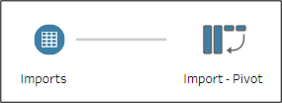
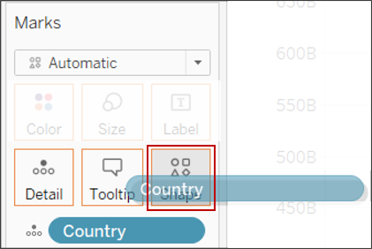
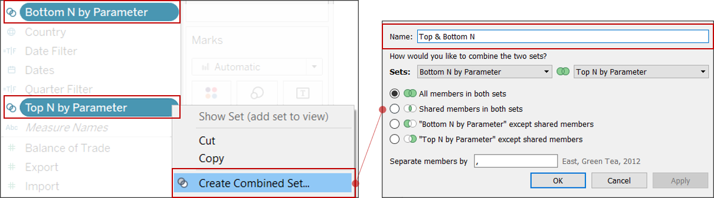
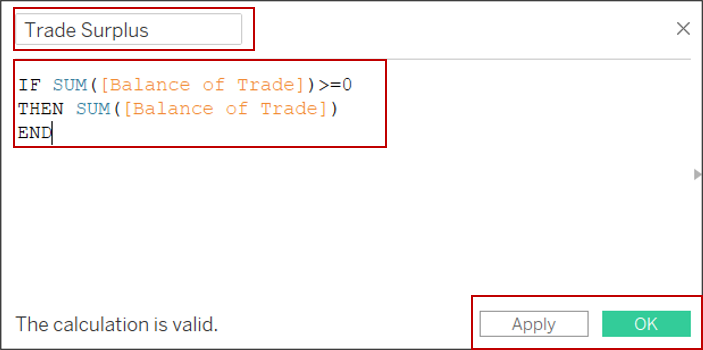
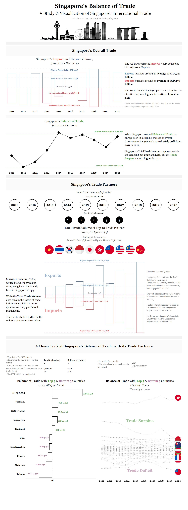

```{r setup, include=FALSE}
knitr::opts_chunk$set(echo = FALSE)

```

## 1. Introduction

The data in this makeover is the Merchandise Trade volume of Singapore from January 2011 to December 2020. 

The data was retrieved from the [Department of Statistics, Singapore (DOS)](https://www.singstat.gov.sg/find-data/search-by-theme/trade-and-investment/merchandise-trade/latest-data).


## 2. Original Data Visualization
```{r, fig.cap="Original Visualization"}
knitr::include_graphics(path='images2/og_animation_2.gif')
```

[Link](https://www.singstat.gov.sg/modules/infographics/singapore-international-trade)

<!---->

### 2.1: Critique: Clarity

Clarity is how clear/lucid the chart in it's message to the reader. The information should be free of ambiguity and confusion. 

1. The chart refers to 2020 trade data, however there is an excerpt is referring to 2006 and 2009. 
   ```{r, fig.cap = "Chart quoting data out of context"}
   knitr:: include_graphics('images2/1-1-0A.png')
   ```
   By quoting that excerpt, the chart has quoted data out of context. <br><br>In the <i>Visual Display of Quantitative Information, 2nd Edition</i> by Edward R. Tufte, he wrote about quoting data out of context. (pp. 74-76) <br><br> It would seem that the excerpt contains a key piece of information: The volatile trade dynamics between countries. <br><br>
   
   This chart does not answer the heart of quantitative thinking, "Compared to what?". The bubble chart made an attempt to highlight that information by including the excerpt. Ultimately, the reader has questions left unanswered by the visuals itself.

2. The surface area of the graphic, size of the bubbles, does not represent the true proportions of the  numbers. <br><br>In correct visualizations, the size of the graphic should be directly proportional to the numerical quantities represented. We can quantify is using the Lie Factor. 


   The Lie Factor was first defined by Edward Tufte.(Tufte, 1983, p.54). The formula below:
$$ 
\text{Lie Factor} = \frac{\text{size of effect shown in graphic}}{\text{size of effect in data}}
$$
   
   The ideal lie factor would be 1, i.e. the graphic shows the exact numerical proportion and as such the graph can be said to have graphical integrity (Tufte, 1983, p.50). 
   
   For example: Comparing the bubble of United States vs Japan. 

   The total volume of trade of USA is SGD 102.4 Bil and that of Japan is SGD 49.6 Bil. USA's volume is approximately 51.6% greater than that of Japan:
$$ 
\text{Size of effect in data} = \frac{102.4 - 49.6}{102.4} * 100 = 51.56\% 
$$
   
   Comparing the diameters of the circle, USA bubble's radius is roughly 2.18 cm and Japan's is 1.05 cm. If we get the area of the circles and compute the magnitude of difference, USA's bubble is 73.8% bigger than Japan's:
$$ 
\text{Size of effect in shown in graphic} = \frac{(2.18^2 - 1.05^2)}{(2.18^2)} * 100 =  76.8\% 
$$

   Computing the Lie Factor, we get:
$$ 
\frac{75.9}{51.66} = 1.49 
$$

   This tells us that the graphic has overstated the differences by 149%. In fact, if we observe the dimensions, we can see that the chart designer has linearly scaled the radius. 
$$
\text{Given that United State's bubble was set at 2.18 cm: }\\
\text{ }\\
\text{Magnitude of Difference} = \frac{102.4-49.6}{102.6} = 0.5166 \\
\text{Sizing of Japan's bubble} =\frac{2.18*0.5166}{2.18} = 1.05
$$

   This is incorrect as linearly scaling the radius results in quadrupled area. 
$$
\text{Given that radius of the bigger circle = } r_{2} \\\text{, radius of smaller circle = } r_{1} \\
\text{ When the radius is linearly scaled i.e. } r_{2} = 2*r_{1}  \\
\text{Ratios of the Circles = } \frac{\text{Bigger Circle}}{\text{Smaller Circle}} = \frac{\pi (2r_{1})^2}{\pi r_{1}} = 4 \\
$$
   Instead the areas of the circles should be scaled.
   
   If we wanted a lie factor of 1, i.e. true representation, the radius of Japan's bubble should have been approximately 1.5 cm to correctly represent the relative volumes. 

   Below shows the visual difference the Lie factor makes:
   ```{r, fig.cap = "Comparing Japan vs United States"}
   
   ```
   This occurs throughout the chart, for example, even with Thailand

   ```{r, fig.cap = "Comparing Thailand vs United States"}
   knitr::include_graphics('images2/1-1-2.png')
   ```

   The perceived measure versus the numerical measure is vastly different.  This erodes the graphical integrity of the chart as it does not accurately represent the true relative proportions.
   
3. The one dimensional volume of trade (addition of import and export) is sized by a two dimensional parameter, area of the circle. The use of circle tend to magnify perceived size as it is a shape of bilateral symmetry. <br><br> The example below shows that even if the area is appropriately scaled, it not poorly perceived that value is twice until explicitly stated or calculated. 
   ```{r, fig.cap = "Area as a poor metaphor of values"}
   knitr::include_graphics('images2/1-1-3.png')
   ```
4. Due to the placements of the bubbles on the chart, i.e. exports and imports coordinates, it is hard for the reader to understand the country's ranking. For example, Malaysia versus United States. Malaysia ranks higher than United States in terms of Trade Volume, however it not clear. There is no visual hierarchy. 

   ```{r, fig.cap = "Lack of Visual Hierarchy"}
   
   ```
5. The tag highlighting net exporter/net importer, as shown in the figure below, is unclear as these dynamics change over time. It could create confusion as the reader might understand that the trade dynamics of Singapore with said country is static, however, that is not the case. For example, in 2017, United States would have the tag of biggest net importer.  
   ```{r,fig.cap = "Importer/Exporter Tags"}
   
   ```
6. The number of variables being explained on the chart exceed the dimensions of the chart. While the axis states Import and Export, the chart attempts to explains 5 phenomenons - Import, Export, Total Volume of Trade, Importer/Exporter roles, Comparison to 2009/2006. 

   This creates a messy chart as there are 5 different concepts, with neither fully explaining one. For example, if the reader would like to know the trade surplus with Singapore top net exporter, Hong Kong, he would be unable to do so as it is unclear from the chart. 
   
7. As a circle is used, a shape of bilateral symmetry, the circumference of the circle also render a reading on the chart, either for export/import. 
   

### 2.2: Critique: Aesthetics

Aesthetics is the visual appeal of the graph.

1. Low data-ink ratio
Data-ink is the non-erasable core of a graphic (Tufte, 1983, p.88). It can be defined as shown below:
$$
\begin{align}
\text{Data-ink Ratio} & = \frac{\text{data-ink}}{\text{total ink to print the graphic}} \\ 
& = 1 - \text{proportion of a graphic that can be erased without loss of informaion}
\end{align}
$$

   If the bubbles were to be removed, the center and labels kept, there will not be any loss of data-information. This makes either the circle or the tooltip redundant ink. 
   
2. The axis is excessively labeled without much information as the reader is only able to get a range of values, but not the exact. 

3. The color of the bubbles do not add information to the chart. In addition to that, some colors are repeated as well. This might lead to confusion leading the user to look up the Country labels. 

   The color of the bubbles in fact do not register any information as our eyes cannot map a trend to colorful signatures. In fact, we're understanding more information from the labels rather than the color. It is, in fact, <i>Chartjunk</i>(Tufte, 1983, p. 102)

4. The overall sizing of the bubbles in relation to the size of the chart is too big. This results in the bubbles crowded and hence, overlapping. 

5. The interactivity of the chart does not add any features to the chart. In fact, it seems that the interactivity was added as a measure to un-hide the overlapping bubbles. 

6. Other Minor critiques include:

 * The coordinate labels are far from the bubbles, and hence the reader must often trace on the chart to retrieve Import/Export values or to derive the Balance of Trade. The interactivity of the chart could have been better implemented.

 * The font type is san-serif, this might provide uneasy reading for the viewer.(Tufte, 1982, p.176)

 * The tooltip of China and Hong Kong is falling outside the area of the chart, as shown below.

   ```{r, fig.cap = "Tooltips escaping the chart"}
   
   ```


## 3: Redesign Sketches

The rough idea of the dashboard and re-design will be like so:

```{r, fig.cap="Proposed Re-design", out.width=600}
knitr::include_graphics(path='images2/Sketch.png')
```

Issues Addressed:

1. Clarity Point 1: The user will be allowed control of the years and quarters. This enables the user to make comparison and does not quote data out of context. In addition to that, there can be comparison made using the Animations function in Tableau that allows the user to visually see the movement of countries in terms of ranking. This will also explain the dynamic nature of trading relationships between countries, often reflecting on the economic activity.

2. Clarity Point 2,3 & 4: The total volume of trade will not be mapped into the area of the bubbles. 
   
   Instead, the country's will be ranked from lowest trade volume to highest trade volume, going from left to right. The country flag / abbreviations will be used to mark the bubbles so as to increase the data-ink ratio. This way the user is immediately able to see and understand the rank of the countries as they will not be scattered on an Import/Export axis.
   
   The country's corresponding import and export will be plotted on a bar chart. As tableau sizes the bar charts vertically, since the width of the bar charts are constant, the relative proportions will be clearly perceived as it is using a one-dimensional object ( a vertical line ) to represent a one-dimensional variable(export, import or total volume of trade).

3. Clarity Point 5: Using Tableau's tooltips, the country's role as a importer/exporter will be prompted upon a hover. There will be a theme of colors used: Red, Blue, Purple and Green. These colors will be used throughout the chart so that the user is able to immediately understand what the colors signify.In addition to that, the Import and Export bars will also make it evident as to whether Singapore is in deficit or surplus with said country.

4. Clarity Point 6: To prevent overcrowding of information, the Balance of Trade chart will be created separately i.e. Supplementary Charts 1 and 2 shown above. This ensures that the no. of information carrying variables do not exceed the dimensions of the chart. 

5. Aesthetics Point 1: The country's identity will be informed using the country's flag as well as the tooltip. This ensures no redundant ink and also increases the data-ink ratio.

6. Aesthetics Point 2 & 3: The axis will not be labeled excessively, instead reference lines, minimum points, maximum points and tooltips will be used to ensure maximum data-ink ratio

7. Aesthetics Point 4: Since we'll be using the barchart instead, there is no issue of overlapping.
The fonts will be selected appropriately. 

8. Aesthetics Point 5: The year and filter toggle allows the user to interact the chart and also the charts will be linked up so that the same filter can be applied to all and different parameters can be compared.

9. Aesthetics Point 6: A serif font will be applied to the chart. As tooltips are activated upon toggle and wrapped within the chart by Tableau, there will be no issue on the overflow. The tooltips also allow the user to activitely retrieve information without having to look at the axis.

## 4. Building the Alternative Design

### 4.1 The Data

The raw data is in `.xlsx` format. 

It contains 2 sheets:

 * T1 : Merchandise Imports by Region/Market, Monthly
 * T2 : Merchandise Exports by Region/Market, Monthly
 
The figure below shows a snapshot of the data: 

```{r, fig.cap= "Snapshot of the raw data", out.extra='style="margin-left: 25px;"', out.width= 600}
  knitr::include_graphics(path='images2/OG.png')
```

### 4.2 Data Preparation

The data was prepared using Tableau Prep Building. 

1. Load the Data.<br>First, drag and drop the data into the Home screen as shown below.
   ```{r, fig.cap = "Measures to Rows/Columns shelf"}
   knitr::include_graphics('images2/4-1-1.png')
   ```
2. Once the data has loaded into the screen, select `Use Data Interpreter`. This will remove unnecessary rows and columns.
   ```{r, fig.cap = "Data Interpreter"}
   knitr::include_graphics('images2/4-1-2.png')
   ```
3. Drag and drop T1 into the workspace
   ```{r, fig.cap = "Drag and drop T1"}
   
   ```
4. Pivot the data.<br> Since the dates are in the columns and the variables (Countries) are row data, we need to pivot the data.

   Right click on the `Import` node and select `Pivot` from the drop down.
   ```{r, fig.cap = "Select Pivot"}
   knitr::include_graphics('images2/4-1-4.png')
   ```
   ```{r, fig.cap = "Pivot Node"}
   
   ```
   Once that is done, select the first date `1976 Apr` + Shift + last date `2021 Mar`. Drag and drop into the `Pivoted Fields Section`.
   ```{r, fig.cap = "Pivoting the date columns into rows"}
   knitr::include_graphics('images2/4-1-6.png')
   ``` 
5. Cleaning the data:
  
   Right click on the Pivot Node and select `Clean Step` from the drop down list
   ```{r, fig.cap = "Adding the Clean node"}
   knitr::include_graphics('images2/4-1-7.png')
   ```
   Rename the columns as shown below.<br>
   Change the `Dates` column to date format - Click on the `Abc` icon and select `Date` from the dropdown. 
   ```{r, fig.cap = "Rename columns and change Date format"}
   
   ```
   Filter the dates<br>
   Select the `Dates` pane and then click on `Filter Values...`. 
   ```{r, fig.cap = "Select the Data panel and then select Filter"}
   
   ```
   Next, add the following formula:
   ```{r, fig.cap = "Formula for Filter"}
   knitr::include_graphics('images2/4-1-10.png')
   ```  
   
   Filter the Country<br>
   Since the data also contains data by continents as well, we have to filer. The data by continents are in millions.
   
   Select the `Country` pane as we did above for dates, and add the following formula:
   ```{r, fig.cap = "Filtering out continents"}
   knitr::include_graphics('images2/4-1-11.png')
   ```
   
   Slicing the country names.<br>
   Since all the country names contain "Thousand Dollars", we will extract only the country names using an `Automatic Split` as shown below.
   ```{r, fig.cap = "Extracting country names"}
   knitr::include_graphics('images2/4-1-12.png')
   ```
   
   The `Import` variable is scaled down by a thousand. Hence, we will use the raw values. This is done as shown below:
   ```{r, fig.cap = "Scaling up Import values by thousand"}
   
   ```
6. Once that is done, we will drag in T2. Rename the node as `Exports`.
   ```{r,, fig.cap = "Adding Export data"}
   
   ```
7. Apply all the data preparation steps for Exports through a copy-paste of the flow.

   Copy the flow that was created for `Imports` (though a click and drag over the space). Right click and select `Copy` and then `Paste` in an empty area. 
   ```{r, fig.cap = "Copy the Flow"}
   
   ```
   
   Drag the `Exports` node over the newly pasted flow and drop into the `Add` box.
   ```{r, fig.cap = "Connect Export node to data prep flow"}
   knitr::include_graphics('images2/4-1-16.png')
   ```
8. Joining the two tables.

   Right click on Import's final step: Clean step and select `Join`.
   ```{r, fig.cap = "Creating Join node"}
   
   ```
   
   The `Join` node will appear. Drag and drop the final step in the Export flow and drop it into the Union node as shown.
   ```{r, fig.cap = "Connecting Export node to Join"}
   
   ```
   The workspace below will be prompted to add in the field for the join.<br>
   Add the following:
   ```{r, fig.cap = "Selecting conditions for Join"}
   
   ```
   A right join is used as there are more countries in Import than Export. This is to prevent any loss of data before the Final Clean.
   
   Right click and add a `Clean Step`
   ```{r, fig.cap = "Final clean"}
   
   ```
10. Remove all duplicated columns. Right click and select `Remove`.

11. Adding `Total Volume of Trade` & `Balance of Trade`
    
    Once the duplicated columns are removed, we will add 2 more calculated fields.
    ```{r, fig.cap = "Adding Balance of Trade and Total Volume"}
    knitr::include_graphics('images2/4-1-21.png')
    ```
12. Remove Null values
    
    Balance of Trade:<br>
    There are null values for the balance of trade as data for export for these countries does not exist. The total value of these make up a small percentage of the total data and hence we will exclude them. 
    
    Right click and select `Exclude`.
    ```{r, fig.cap = "Excluding null values for BOT"}
    
    ```
    
    Total Volume of Trade:<br>
    We will remove the rows where total volume of trade is zero.
    
    Do as shown below:
    ```{r, fig.cap = "Excluding null values for Total Volume"}
    
    ```
13. Right click on the `Final Clean` node and select `Preview in Tableau Desktop`.
    ```{r, fig.cap = "Exporting to Tableau Desktop"}
    knitr::include_graphics('images2/4-1-24.png')
    ```
    
    The data is ready for visualization. Save the workbook in local directory. 
    
### 4.3 Creating the Chart

1. Right click on the `Country` variable in the `Data` pane and select `Aliases`. We will change the names so that they appear shorter in the labels/tooltips.
   ```{r, fig.cap = "Adding aliases"}
   
   ```
   ```{r, fig.cap = "Commit changes"}
   knitr::include_graphics('images2/4-2-2.png')
   ```
2. Create the following worksheets shown below.
   ```{r, fig.cap = "Creating worksheets"}
   
   ```
   
   According to the sketch, we will create two overall charts: Overall Bar and Overall Line.
   
   The re-visualization of the original chart will be prepared in two parts and then place together on the dashboard, Movement of Trade Partners, MOTP (1) and MOTP (2).
   
   The supplementary charts are Balance of Trade and Overall Balance of Trade. 
   The Balance of Trade chart will show the top 5 and bottom 5 in terms of balance of trade, whereas the Overall Balane of Trade will follow the Singapore's account with said country from 2011 to 2020. 
   
3. <u>Creating the first chart: Overall Bar</u>
   
   1. Drag and drop the variables into the `Rows` and `Columns`
      ```{r, fig.cap = "Measures for Overall Bar"}
      knitr::include_graphics('images2/4-2-4.png')
      ```
      This will create 2 charts, one for the export and one for import on separate axis.
      
   2. Under the `All` Marks card, change the chart type to Bar. 
      ```{r, fig.cap = "Change to Bar chart"}
      knitr::include_graphics('images2/4-2-5.png')
      ```
      By doing so, we have changed both charts to a bar type.

   3. We will invert the `Import` bar chart next. This is so that the reader can visually comprehend the total volume of trade at the particular Year.
   
      Right click on the `Import` y-axis and select `Edit Axis...`
      ```{r 4-2-6, fig.cap = "Inverting Import Chart"}
      knitr::include_graphics('images2/4-2-6.png')
      ```
      We will also truncate the bar chart and set the start point at SGD 350 Billion.
      ```{r, fig.cap = "Truncating bar chart"}
      
      ```
      Set the start point at SGD 350 Billion for `Export` axis too. Note that the start point should be set at 350 Billion for both. 
      ```{r, fig.cap = "Repeat for Export chart"}
      
      ```
   4. We will add reference lines. These reference lines will serve as markers instead of the axis ticks. This is to increase the data-ink ratio. As the chart is interactive, there is not much need for the axis markings.
    
      Reference will be added at 2 points for both import and export: Minimum and Maximum. A third line will be added that will be shared between the two at 350 Billion. This is so that the reader knows the start point. <br><br>
      Right click on the `Export` y-axis and select `Add Reference Line`. 
      ```{r, fig.cap = "Adding reference line"}
      knitr::include_graphics('images2/4-2-9.png')
      ```
      Add the following settings to the reference line.
      ```{r, fig.cap = "Configuring the position reference line"}
      
      ```
      Once the line has been added to the chart, right click on the line and select `Format`.
      ```{r, fig.cap = "Formating the line"}
      knitr::include_graphics('images2/4-2-11.png')
      ```
      The `Format` pane will be prompted on the left. <br>Under `Alignment` set the display to be in the center.  
      ```{r, fig.cap = "Configuring the aesthetics of reference line"}
      knitr::include_graphics('images2/4-2-12.png')
      ```
      Under `Numbers`, set the display a abbreviated numbers. <br> Set the number to 2 decimals. 
      ```{r 4-2-13, fig.cap = "Rounding up the numbers displayed"}
      
      ```
      Repeat the above for Maximum and also for the Imports chart.<br><br>
      The line will be <b>red</b> for `Imports`.<br><br>
      The chart at this point will look like so:
      ```{r, fig.cap = "Intermediate Chart"}
      knitr::include_graphics('images2/4-2-14.png')
      ```
   5. Next, we will set the color of the bar chart to be white, and only showing the border.<br> Select *blue* for `Export` and *red* for `Import`<br><br> This is done so that the colored bars do not overpower the chart and create redundant ink. 
    
      Set the colors of the bars:
      ```{r 4-2-14A, fig.cap = "Setting up the colors of the bar chart"}
      knitr::include_graphics('images2/4-2-14A.png')
      ```
   6. Hide the axis for both chart. Right click on the axis/measure in the `Rows` shelf and un-check `Show Header`.
      ```{r 4-2-15, fig.cap = "Hide axis"}
      knitr::include_graphics('images2/4-2-15.png')
      ```
   7. Hide the field labels i.e. column labels. Right click on the label and select `Hide Field Labels for Columns`.
      ```{r 4-2-45, fig.cap='Hide Field labels'}
      knitr:: include_graphics('images2/4-2-45.png')
      ```
   8. Edit the title. Right click on the chart and edit as show. 
      ```{r, fig.cap = "Editing the title"}
      
      ```
      Edit the title as shown below. Bold and color the words Import and Export and this reinforces to the reader that red=Import and blue=Export. 
      ```{r 4-2-17, fig.cap = "Inking text data"}
      
      ```
   9. Edit tool tips. Select the `Tooltip` box under All marks card. 
      Make the changes as shown below:<br>
      The rest of the text will be in grey and font size 10 while the values will be font size 12<br> Also, they will be color coded and bolded. <br><br> This is done as data inking.
      ```{r 4-2-18, fig.cap = "Setting font format for Tooltips"}
      
      ```
      Next, we will format the Tooltips number so that it only shows decimal places.
      First, right click on the variable in the `Rows` shelf and select `Format`. 
      ```{r 4-2-18A, fig.cap = "Formatting Tooltip number"}
      
      ```
      Under both `Axis` and `Pane`, set the Number to only display 2 decimal places in the billions.
      ```{r, fig.cap = "Change in both Axis and Panes"}
      knitr::include_graphics('images2/4-2-18B.png')
      ```
      Repeat the process for all `Tooltips` measures.
      
   10. Remove the grid lines. All grid lines will be removed. Right click on an empty space in the chart, and select `Format`. Select None for all as shown below.
       ```{r 4-2-19, fig.cap = "Removing borders and dividers"}
       
       ```
       This removes all the external borders and dividers. In order to remove the internal gridlines, we will do as follows:
       ```{r 4-2-19A, fig.cap = "Removing chart gridlines"}
       
       ```
       This is done as the grid lines are redundant ink. They have no purpose as any data required can be read directly through the Tooltips.
      
   11. Change all fonts, to Sitka and font size 10pt. Right click on the axis/reference line/title and select `Format` to change the font, font size and also to bold it. 
       ```{r, fig.cap = "Changing aesthetics"}
       
       ```
   12. The chart will look like so:
       ```{r, fig.cap = "Final Product of Overall Bar"}
       
       ```
4. <u>Creating the second chart: Overall Line chart</u>
  
   1. Drag and drop the variables into the `Rows` and `Columns`. We will drag `Balance of Trade` twice. We do this so that one of the chart can serve as markers.
      ```{r, fig.cap = "Measures for Overall Line"}
      
      ```
   2. Two charts will appear. Click on the axis of the bottom chart, and select `Dual Axis` and then synchronize them to ensure that the circles and line add up.
      ```{r, fig.cap = "Create a dual axis"}
      
      ```
      ```{r, fig.cap = "Synchronize"}
      knitr::include_graphics('images2/4-2-24.png')
      ```
   3. On the Marks pane, on either one of the charts, change the chart type to `Circle` and set the color to black. <br> This is done so that the point along the lines are bigger and clearer and the user can hover over the points easily. Aesthetically, it is easier to track the points when the markers are larger. 
      ```{r, fig.cap = "Setting the up the Circle chart"}
      knitr::include_graphics('images2/4-2-25.png')
      ```
      Leave the other chart as a `Line` type.
      
   4. Just as we did earlier, the y-axis will be hidden (see figure \@ref(fig:4-2-15)) and we will only show 2 reference lines to increase the data-ink ratio.
   
      1. One for maximum and one for minimum.
      2. Set the color to green and label it as "Highest/Lowest Trade Surplus: SGD <Value>"
      3. This is done so that the reader associates the color green for Trade Surplus.
  
   5. We will truncate the y-axis to start from 15 billion.
      ```{r, fig.cap = "Truncating the y-axis"}
      knitr:: 
      ```
   6. Make the changes to the Tooltip as well as the title as we did for the previous chart.(see Figures \@ref(fig:4-2-17) \@ref(fig: 4-2-18))
      This time using the color *green* to mark the `Balance of Trade`.
      
   7. Set the numbers to 2 decimal places for the tooltips (see Figure \@ref(fig:4-2-18A)) and reference lines(see Figure \@ref(fig:4-2-13))
   
   8. Remove all gridlines (see Figures \@ref(fig:4-2-19)) and axis lines (see Figures \@ref(fig:4-2-19A))) as we did earlier.
      
   9. The chart will look like so:
      ```{r, fig.cap = "Final Product of Overall Line"}
      knitr:: 
      ```
  
5. <u>Creating the third chart: MOTP (1)</u>
   
   This chart is the re-visualization of the original chart.
   
   1. Drag and drop the variables into the `Rows` and `Columns`. 
      ```{r, fig.cap = "Measures for Overall Line"}
      knitr:: include_graphics('images2/4-2-28.png')
      ```
   2. Drag and drop the `Country` variable into the detail box, as currently it is an aggregated point. This way each point will refer to a particular country.
      ```{r, fig.cap = "Adding Country to detail"}
      knitr:: include_graphics('images2/4-2-29.png')
      ```
   3. Add filter for country. <br> This is done as we want to show the top 10 partners per year respective to Total Volume of Trade.<br><br>
      Drag and drop `Country` into the Filters box.
      ```{r,fig.cap = "Add Country into Filters"}
      knitr:: 
      ```
      Next we will make the changes as shown below. This will sieve out the top 10 by the `Total Volume of Trade` by the year. We will configure the year filter in the following few steps later on. 
      ```{r, fig.cap = "Filtering top 10 Countries by Total Volume"}
      knitr:: 
      ```
   4. Drag and drop `Country` into the shape box. This way we will be able to customize the icons.
      ```{r 4-2-33, fig.cap = "Add Country to shape to customise the icons"}
      knitr:: 
      ```
      On the right pane, the shape legend will come up. Select `Edit Shape`.
      ```{r, fig.cap = "Edit Shape under Shape legend"}
      knitr:: 
      ```
      Select relevant country icon pack. This icon pack was downloaded from [Flaticon.com](https://www.flaticon.com/) and [Freepik.com](https://www.freepik.com).
      ```{r, fig.cap = "Adding custom icon pack"}
      knitr:: 
      ```
   5. Creating parameter. The year and quarter will be user toggled, hence we will create two parameters.
      1. Click on the arrow button in the Data pane and select `Create Parameter`.
         ```{r, fig.cap = "Create Parameter"}
         knitr:: 
         ```
      2. Create the Year parameter
         ```{r, fig.cap = "Configuration for Year Parameter"}
         knitr:: 
         ```
      3. Create the Quarter parameter
         ```{r,fig.cap="Configuration for Quarter Parameter"}
         knitr:: 
         ```
   6. Next, we will create the calculated fields to link the parameter to. <br> Click on the arrow button in the Data pane and create 2 fields to be linked to the parameter.
      1. Date Filter
         ```{r, fig.cap = "Formula for Date Filter"}
         knitr:: 
         ```
      2. Quarter Filter
         ```{r, fig.cap = "Formula for Quarter Filter"}
         knitr:: include_graphics('images2/4-2-40.png')
         ```
   7. Drag and drop the `Date Filter` and `Quarter Filter`. Select True when the window, shown below, prompts upon dropping.
      ```{r, fig.cap = "Select True"}
      knitr:: 
      ```
   8. Right click on both filters and select `Add to Context`. This is so that Tableau applies the data and quarter filter before sorting out the top 10 values as Tableau follows an order of operations when applying filters.
      ```{r 4-2-42, fig.cap = "Add to context"}
      knitr:: 
      ```
   9. In the `Parameters` Pane, right click on both year and quarter parameters to select `Show Parameter`
       ```{r, fig.cap = "Show parameters"}
       knitr:: 
       ```
       The parameter pane will appear on the left to be toggled. However, this will be used for debugging purposes. The parameter controls will be the `Year Buttons` and `Quarter buttons` that will be created later on. 
       
   10. Edit the title. Insert the dynamic parameter values so that the title changes according the the user selection.
       ```{r 4-2-44, fig.cap = "Create a dynamic title"}
       knitr:: 
       ```       
   11. Create 2 calculated fields `NetExporter` and `NetImporter`. This way when the user hover over the country icons, the role of the country and year will be evident.
       ```{r, fig.cap = "Create Calculated Field: Net Exporter"}
       knitr:: include_graphics('images2/4-2-44A.png')
       ```
       ```{r, fig.cap = "Create Calculated Field: Net Importer"}
       knitr:: include_graphics('images2/4-2-44B.png')
       ```
       Drag and drop into the Tooltip box
       ```{r, fig.cap = "Add to Tooltip"}
       knitr:: 
       ```
       Edit as shown below:
       ```{r, fig.cap = "Add color coding"}
       knitr:: 
       ```
   11. Remove all grid lines/headers/field labels as we did previously<br>
       See figures:
        * Hiding Axis: \@ref(fig:4-2-15) 
        * Outer gridlines: \@ref(fig:4-2-19)
        * Inner gridlines: \@ref(fig:4-2-19A)
        * Hide field labels: \@ref(fig:4-2-45)
        
   12. The chart will look like so:
       ```{r, fig.cap = "Final product of MOTP(1)"}
       knitr:: include_graphics('images2/4-2-46.png')
       ``` 
6. <u>Creating the fourth chart: MOTP(2)</u>

   1. This chart will look similar to the Overall Bar Chart that we created previously. 
      First drag and drop the variables into the `Rows` and `Columns`.
      ```{r, fig.cap = "Measures for MOTP(2)"}
      knitr:: 
      ```
   2. Drag and drop `Date Filter`, `Qtr Filter` and `Country` into the filters box. 
   
       * Add `Date Filter` and `Qtr Filter` to context (see Figure \@ref(fig:4-2-42))
       * The `Country` should be filtered by Total Volume of Trade as MOTP (1) would be linked to this chart as shown below. 
         ```{r, fig.cap = "Filters to be added"}
         knitr:: 
         ```
   3. We will invert the `Import` axis as we did earlier for the Overall Line Chart (see Figure \@ref(fig:4-2-6))
   
   4. Now, we have to sort the chart so that it follows MOTP(1)'s countries.<br><br> To do so, drag and drop `Total Volume of Trade` into the `Rows` shelf. 
   
      ```{r,fig.cap = "Drag and drop Total Volume of Trade into Rows"}
      knitr:: include_graphics('images2/4-2-46-3.png')
      ```
      A third chart will appear below. Select the chart by clicking on the axis, and then select the sort button on the Toolbar above
      ```{r,fig.cap = "Select the chart"}
      knitr:: 
      ```
      ```{r,fig.cap = "Sort in ascending, so that highest appears on the right"}
      knitr:: 
      ```
      By doing so, the chart will now be sorted according to `Total Volume of Trade`. 
      Once it is sorted, select the variable from the `Rows` shelf and drag it away effectively removing the third chart. 
      
   5. Set the colors of the bar charts to white with only the borders colored, red for imports and blue for exports, the steps can be found above as we did for the Overall bar chart. (see Figure \@ref(fig:4-2-14A))
 
   6. Add a reference line to label the chart area. Instead of using axis label, we will place the label in the background of the chart. 
   
      Right click Export axis and make the following changes below. The average calculation is arbitrary, it can be any constant value as long as it places it somewhere in the middle of the chart. However, as the user toggles the filters, selecting a dynamic calculation will allow the reference line to be re-calculated and hence stay at the same relative position.
      ```{r, fig.cap = "Configuring the reference line"}
      knitr:: include_graphics('images2/4-2-46-6.png')
      ```
      Once that is done, right click on the reference point and select `Format`<br>
      Make the following changes:
      ```{r,fig.cap = "Formatting the reference line"}
      knitr:: include_graphics('images2/4-2-46-7.png')
      ```
      Under `Alignment`. align the text to the left.<br><br>
      Repeat for `Imports`, labeling it as "Imports" and also using the same color as the bar chart (red)
      
   6. Editing Tooltips. Drag and drop the following variables into the Tooltip box.
      ```{r,fig.cap = "Formatting the reference line"}
      knitr:: include_graphics('images2/4-2-46-9.png')
      ```
      Format is as follows:
      ```{r,fig.cap = "Formatting the reference line"}
      knitr:: 
      ```
      
   7. The chart will look like so:
      ```{r,fig.cap="Final product for MOTP(2)"}
      knitr:: include_graphics('images2/4-2-46-8.png')
      ```
7. <u>Creating the fourth chart: Balance of Trade chart</u>

   1. Drag and drop the variables into the `Rows` and `Columns`.
      ```{r,fig.cap= "Measures for Balance of Trade chart"}
      knitr:: include_graphics('images2/4-2-47.png')
      ```
   2. Create 2 parameters, `Top N` and `Bottom N`. These parameters will be user toggled. This will give the user autonomy to see 1-15 top countries that Singapore is in surplus with and similar 1-15 top countries that Singapore is in deficit. This
   
      ```{r,fig.cap= "Configuring Top N"}
      knitr:: 
      ```
      ```{r,fig.cap= "Configuring Bottom N"}
      knitr:: 
      ```
   3. Right click on the `Country` variable and create 2 sets, `Top N by Parameter` and `Bottom N by Parameter`. This way, the top N and bottom N values will be displayed.
      ```{r,fig.cap= "Creating a set"}
      knitr:: include_graphics('images2/4-2-50.png')
      ```
   4. Combine the two created sets and `Create Combined Set`.<br>Click on the first parameter + CTRL + click on the second parameter. 
      ```{r,fig.cap= "Combining the set"}
      knitr:: 
      ```
   5. Drag and drop the newly created set, `Date Filter` and `Quarter Filter` into the Filters box. Just as we did before, add `Date Filter` and `Quarter Filter` to context.(see Figure \@ref(fig:4-2-42)) <br> Next, click on the Sort button as show below. 
      ```{r,fig.cap= "Sorting the combined set"}
      knitr:: include_graphics('images2/4-2-52.png')
      ```
   6. Creating dynamic labels.
   
      1. Create calculated fields `Trade Surplus` and `Trade Deficit`.
         ```{r,fig.cap= "Create calculated field: Trade Surplus"}
         knitr:: 
         ```
         ```{r,fig.cap= "Create calculated field: Trade Deficit"}
         knitr:: include_graphics('images2/4-2-54.png')
         ```
      2. Drag and drop the newly created field in the `Label` box.
         ```{r,fig.cap= "Drop Trade Surplus and Trade Deficit into Label"}
         knitr:: include_graphics('images2/4-2-55.png')
         ```
      3. Click on the box and edit that. We will use purple to denote for `Trade Deficit` and green `Trade Surplus` as we did for the Overall Line chart.
         ```{r,fig.cap= "Color coding"}
         knitr:: include_graphics('images2/4-2-56.png')
         ```
   7. Set the color of the bars to white and only display the *black* borders, just as we did previously.(see Figure @\ref(fig:4-2-14A)) This allows the colors of the labels to be in contrast.
   
   8. Edit the axis
      1. Set the tick to a very large value as we will only show the zero mark. 
         ```{r,fig.cap= "Removing additional ticks"}
         knitr:: 
         ```
      2. Set the range of the axis as the following so that the the bottom countries(negative values can be seen)
         ```{r,fig.cap= "Range of x-axis"}
         knitr:: 
         ```
   9. Edit the title as shown below, insert the parameters as we did earlier(see Figure \@ref(fig:4-2-44))
      ```{r,fig.cap= "Editing the title"}
      knitr:: include_graphics('images2/4-2-60.png')
      ```
   10. The chart will look like so:
       ```{r,fig.cap= "Final product of Balance of Trade Chart"}
       knitr:: 
       ```
8. <u>Creating the fifth chart: Overall Balance of Trade</u>
   1. Drag and drop the variables into the `Rows` and `Columns`.
      ```{r,fig.cap= "Measures for Overall Balance of Trade"}
      knitr:: include_graphics('images2/4-2-62.png')
      ```
   2. Drag the drop the variables as shown below
      ```{r,fig.cap= "Page and Marks measures"}
      knitr:: 
      ```
   3. Under the `Year of Date` controls that pop up on the right legend pane, make the following changes so that as the icons move along the years, and the user can see the trail. <br>Select `Show History` and make the change:
      ```{r,fig.cap= "Trail settings"}
      knitr:: include_graphics('images2/4-2-71.png')
      ```
   4. Add a filter so that the chart only shows the Top 15 and Bottom 15 countries that appear in the Balance of Trade chart. 
      ```{r,fig.cap= "Country filter to be added"}
      knitr:: include_graphics('images2/4-2-64.png')
      ```
      Edit shape and add the country icon pack as we did earlier.(see Figure \@ref(fig:4-2-33))
      ```{r,fig.cap= "Customizing shape icons"}
      knitr:: 
      ```
      
   5. Edit the tooltip as shown below
      ```{r,fig.cap= "Editing the tooltip"}
      knitr:: include_graphics('images2/4-2-66.png')
      ```
   6. Adding references to show the Surplus and Deficit areas. To keep redundant ink minimal, we will not shade in the area. Instead we will add in reference lines as we did before. 
   
      1. Surplus Area
         The value at which the line will be placed it arbitrary.
         ```{r,fig.cap= "Configuring surplus reference line"}
         knitr:: include_graphics('images2/4-2-67A.png')
         ```
         Format the line as such:
         ```{r,fig.cap= "Formatting surplus reference line"}
         knitr:: include_graphics('images2/4-2-67B.png')
         ```
      2. Zero Line
         Just as we did before, instead of using the axis ruler, a reference line will be placed.
         ```{r,fig.cap= "Configuring zero reference line"}
         knitr:: include_graphics('images2/4-2-68A.png')
         ```
         Format the line as such:
         ```{r,fig.cap= "Formatting zero reference line"}
         knitr:: include_graphics('images2/4-2-68B.png')
         ```
      3. Deficit Area
         The value at which the line will be placed it arbitrary.
         ```{r,fig.cap= "Configuring deficit reference line"}
         knitr:: include_graphics('images2/4-2-69A.png')
         ```
         Format the line as such:
         ```{r,fig.cap= "Formatting deficit reference line"}
         knitr:: include_graphics('images2/4-2-69B.png')
         ```
   7. Edit the title
      ```{r,fig.cap= "Editing the title"}
      knitr:: 
      ```
   8. The chart will look like so:
      ```{r,fig.cap= "Final product of Overall BOT chart"}
      knitr:: 
      ```
9. <u>Creating the Year buttons</u> 

   Instead of using the drop down for the parameter controls, we will create custom Year buttons for aesthetic purposes. 
   
   Drag and drop the following in `Columns`.
   ```{r,fig.cap= "Measures for Year buttons"}
   knitr:: include_graphics('images2/4-2-73.png')
   ``` 
   Change the chart type to Shape and increase the size. 
   ```{r,fig.cap= "Change shape and size"}
   knitr:: 
   ```
   Drag and drop `Dates` to the Label box and edit as shown below so that the Year is displayed in the center of the circle
   ```{r,fig.cap= "Add Dates to label"}
   knitr:: 
   ```
   Click on Tooltips and uncheck `Show tooltips`.
   ```{r,fig.cap= "Disabling tooltips"}
   knitr:: 
   ```
   Remove all gridlines/dividers so that only the circles will be visible.
   ```{r,fig.cap= "Removing all gridlines/dividors"}
   knitr:: include_graphics('images2/4-2-77.png')
   ```
   Hide the Title/Axis/Field Labels etc. 
   
   Set the color of the circle as white and border as black. 
   
   The buttons will look like so:
   ```{r,fig.cap= "Final product of Year buttons"}
   knitr::include_graphics('images2/4-2-82.png')
   ```
   
10. <u>Creating the Quarter buttons</u>

    Create a calculated field `Qtr Buttons`. This is an arbitrary field to create values 0-4.
    ```{r,fig.cap= "Creating Quarter field"}
    
    ```
    
    Drag and drop the newly created variable into the `Column` pane. Click on the triangle drop down, set to `Dimension`. Click again and `Edit Aliases..` as shown below.
    ```{r,fig.cap= "Setting to Dimension and Change Aliases"}
    
    ```
    Drag and drop `Qtr Buttons` into the label box.
    ```{r,fig.cap ="Add quarter labels"}
    
    ```
    Edit the aesthetics of the buttons and make the changes as we did for Year too.
    ```{r,fig.cap ="Formating the buttons"}
    
    ```
    The buttons will look like so:
    ```{r,fig.cap ="Final product of Quarter buttons"}
    knitr::include_graphics('images2/4-2-83.png')
    ```
11. <u>Setting Up the Dashboard</u>

    Once the charts have been positioned on the Dashboard(See [Final Viz](#label)), we will connect them. This will be done using `Actions`. 
    ```{r,fig.cap ="Using Actions"}
    knitr::include_graphics('images2/4-2-84.png')
    ```
   
    There will be 2 dynamics set using Actions.
      
    Parameter Actions. <br>`Year Buttons` and `Qtr Buttons` will be set using these.<br> This will connect the values of the Year and Qtr buttons to the actual parameter selections. <br>Under Actions (as shown above), select `Add Action` and then `Change Parameter`. 
    ```{r}
    
    ```
    Select the corresponding Parameters that the button connects to as shown below.
    ```{r}
    knitr::include_graphics('images2/4-2-86.png')
    ```
    ```{r}
    
    ```
    Highlight Action <br> 2 highlight actions will be set.
      
    The first one will be between `Overall Bar` and `Overall Line`. Any selection in either chart, will highlight the other charts at that particular year. Set the following settings. <br>Under Actions (as shown above), select `Add Action` and then `Highlight..`.
    ```{r}
    
    ```
    Set the settings shown below. 
    ```{r}
    
    ```
    The second highlight action will be between the other 3 charts. This would be set up such that any selection of a Country bubble, will highlight the country in the other 2 charts. This way the reader can select any particular country he wishes to see. 
    ```{r}
    
    ```
12. <u>Adding animations</u>

    To ensure that the charts transition smoothly, we will add animations.
   
    Under `Format`, select `Animations..`
    ```{r}
    
    ```
    When the Animations pane shows up on the right, make the following changes. It will be set to Slow so that the user can see the movements and track the ranking of the countries(via multi select) over time. 
    ```{r}
    
    ```
## 5. Final Visualization {#label}

The final interactive dashboard looks as such:

```{r}

```
To see the interactivity & animations:

[Tableau Public Link](https://public.tableau.com/profile/aryah.umralkar.chopra#!/)

## 6. Insights 

<u> Overall Trade Insights</u><br>
<i>Dashboard Section Reference: Singapore's Overall Trade</i>

Singapore's Balance of Trade has always been in a surplus.
	
From 2011 to 2020, the surplus has increased by approximately 70% overall. 
	
If we look at the total volume over the years, the volume of trade in 2020 (940 Billion) is approximately the same as that in 2011 (943 Billion). However, the Balance of Trade is much higher. This is like the [outcome of shifting saving and investment behaviours in the domestic economy](https://www.mas.gov.sg/monetary-policy/Singapores-Monetary-Policy-Framework/faqs/section-5).

<u>Volume of Trade Insights</u><br>
<i>Dashboard Section Reference: Singapore's Trade Partners</i><br>
<i>Chart Reference: Total Trade Volume of Top 10 Trade Partners</i>

1. Once a prominent Trade Partner of Singapore, Indonesia's trade with Singapore has been on a decrease since 2014. 

	In 2011, total volume of Trade of Indonesia with Singapore was 81.56 Billion comparable to China's 101.75 Billion, and was approximately 80% of the highest volume (Malaysia)
	
	In 2020, total volume of Indonesia went to 48.82 billion, compared to China's 136.20 billion, making it 35.8% of the highest volume (China)
	
	We can see that the highest drop began in Quarter 3 of 2013 due to the [plunge in rupiah](https://www.straitstimes.com/business/singapore-economy-may-be-adversely-affected-by-indonesia-slowdown-economists).
	
2. Consistently, Malaysia, China, United States and Hong Kong have been Singapore's top trade partners over the years and has extensive trade with most of the countries it has [established trade agreements with](https://www.enterprisesg.gov.sg/non-financial-assistance/for-singapore-companies/free-trade-agreements/ftas/singapore-ftas).

3. We can see China's [meteoric rise](https://www.everycrsreport.com/reports/RL33534.html) in the world reflected in Singapore's trade too.
	
	From 2011, China has risen up, very quickly establishing itself by the third quarter of 2015 as Singapore's biggest partner. 
	
4. While the top 9 countries rotate between, China, Hong Kong, Malaysia, Taiwan, United States, Indonesia, Japan, South Korea, and Thailand. 
	
	The 10th position is often changes. It is taken by U.A.E., Australia, India, Vietnam


<u>Balance of Trade Insights</u><br>
<i>Dashboard Section Reference: A Closer Look</i><br>
<i>Chart Reference: Balance of Trade (both)</i>

1. Hong Kong has been in a trade surplus with Singapore consistently through the years.  
	
	 The surplus has increased by approximately 11%. 
	
	 Hong Kong is the [world's leading cargo transshipment hub](https://www.ship-technology.com/projects/port-hong-kong/) and has a [long standing relationship with Singapore](https://en.wikipedia.org/wiki/Hong_Kong%E2%80%93Singapore_relations#Trade_relations) since the 19th century. Trade has been active between these countries.

2. In addition to a falling total trade volume with Indonesia, the trade surplus has also reduced over the years. 
	
	From a surplus of 32 Billion in 2011 to 10.32 billion in 2020. 
	
3. Singapore was consistently in deficit with United States from 2011 - 2019. However, in 2020 Quarter 2, Singapore went into a surplus with United States, making United States the 6th highest surplus at 5.67 billion in 2020 overall. 

   This is likely due to the [Covid-19 Pandemic](https://tradingeconomics.com/singapore/exports/united-states) and [United States reliance on medical and pharmaceutical goods](https://research.stlouisfed.org/publications/economic-synopses/2020/09/16/the-dynamics-of-the-u-s-trade-deficit-during-covid-19-the-role-of-essential-medical-goods)

4. While Vietnam is not in Singapore's top 10(Until 2020) in terms of volume of trade, there is a sizeable trade surplus in the trade relationship. Consistently, approximately 20% of the largest surplus, ranging from 10-11 billion. 
   
   This is likely due to strengthening ties between Singapore and Vietnam were elevated to that of [Strategic Partnership in 2013 encouraging investment and trade](https://www.mfa.gov.sg/Overseas-Mission/Hanoi/Important-Information/Singapore-Vietnam-Relations#:~:text=Bilateral%20trade%20between%20Singapore%20and,in%20its%20human%20resource%20development).

5. Trade deficit has been consistently large with Taiwan and Saudi Arabia, with Taiwan's the largest since 2018.

   The major export of Saudi Arabia to Singapore is [oil and plastic](https://www.mfa.gov.sg/Overseas-Mission/Hanoi/Important-Information/Singapore-Vietnam-Relations#:~:text=Bilateral%20trade%20between%20Singapore%20and,in%20its%20human%20resource%20development) which is crucial to Singapore's manufacturing and electronics industry.
   
   Taiwan relationship with Singapore was further cemented in 2013 
   
